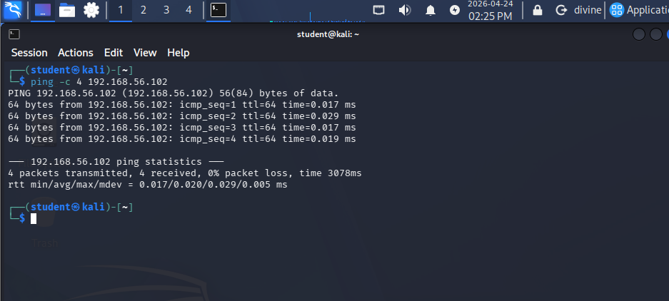
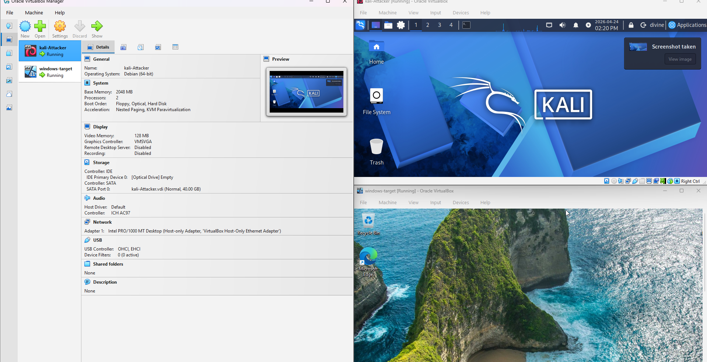

Project 1: Isolated Security Lab Setup

The Goal: To build a secure and isolated virtualization lab to perform 
any vulnerability assessments without impacting production networks.

1. Tools: Oracle VirtualBox, Kali Linux, Windows 11 Enterprise.
2. Skills Learned: Virtualization & Network Isolation

