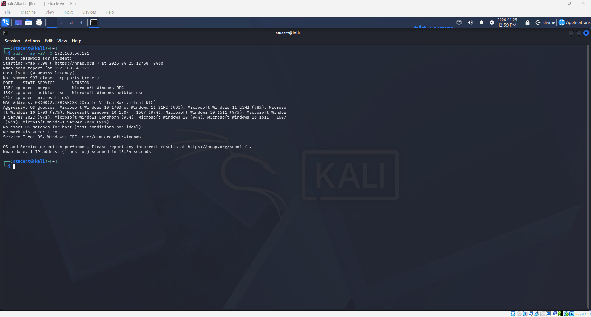

Project 2: Network Vulnerability Assessment and Service Mapping

**The Goal**

To perform an Active surveillance scan on the target workstation to identify any open ports,
active services, and potential attack vectors.

**Technical Implementation**

- Tools used: Nmap (Network Mapper) from Kali Linux
- Commands Used: sudo nmap -sV -O [Target_IP]
- Target of choice: Windows 11 Enterprise (internal lab node)

**Results**
1. Port 135(msrpc): The remote procedure call service was identified. provides an entry point for system enumeration.
2. Port 139/445(Netbios/smb): service was identitfied as Microsoft-DS
   1. Risk: These ports are high-priority targets for ransomware and exploits. Unrestricted SMB access is a huge security non-compliance issue.

**Possible Solutions**

- Immediate Action: Implement host-based firewall rules to "stealth" these ports from unauthorized subnets.
- Long-term action: Disable the SMBV1 and enforce smb signing to prevent potential man-in-the-middle attacks.

**Things I learned**

Some of the things I learned during this project were the difference between closed and stealth(filtered) ports. A closed port on a computer can respond to a ping by saying, "I exist, but I will not accept a connection on this port." Alternatively, a stealth port ignores the ping entirely. Stealth ports are better sometimes when an attacker is seeking entry, since a closed port still signals that a live computer exists at the IP address and gives attackers an incentive to keep attacking. In contrast, a stealth port makes it uncertain whether anything exists there, like hiding in fog or rather security through obscurity. This approach can also allow time to counter an attack by blocking the attacker's IP address if they use tools such as Nmap. I learned that it is not possible to simply close every port because some ports are needed for system operation. For example, if a department needs to send messages privately on port 445 (SMB), the firewall can stealth the port for everyone else but keep it open for the department. Lastly, I learned what the command to search an IP address using nmap does.

- Sudo: superuser do, allows a system admin to perform a task
- nmap: network mapper, software that sends data packets to devices and creates a map of the network based on their responses
- -sV: Service/version detection: it's a scan that determines exactly what service is running and its specific version number.
- -O: operating system detection: Nmap searches the technical fingerprint and checks the target network response to guess which OS the device is using. so things like its window size, error handling, time to live(TTL), etc.
-  [target_ip]: the digital address of the computer that needs to be scanned.

