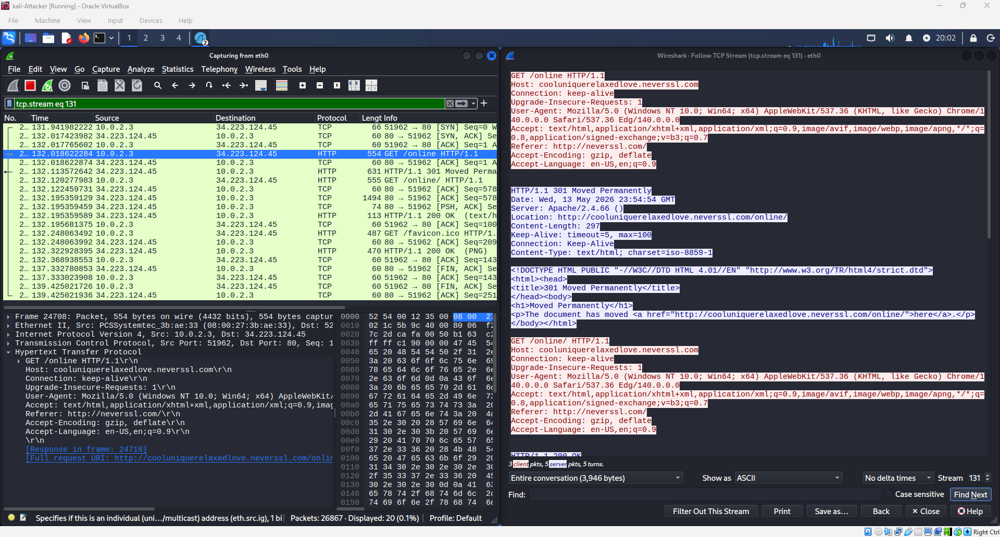

### **Project 3: Network Traffic Analysis with Wireshark**

#### **The Goal**
- To look at network data as it moves between computers and to learn why encrypting data is necessary to keep it safe in information security.

#### **Technical Implementations**
- **Software used:** Wireshark via Kali Linux.
- **Targets:** Network traffic generated by Windows 11 Enterprise Target Node.
- **Network changes:** Changed the network card settings to Promiscuous mode(allow all) so the Kali machine could listen to all network traffic, including the one from the Windows 11 node.
- **Websites Visited:** to make sure Wireshark can pick up network traffic during its scan and to see the data in plaintext once found, I went to unencrypted websites such as 
(http://httpbin.org and http://neverssl.com) and filtering for both HTTP and TCP Port 80 to make sure it's found.

#### **Key findings**
- **The Problem:** The Windows computer was sending data over the network without encryption while visiting certain websites.
- **The Evidence:** When using a tool like Wireshark, I was able to see the data in real-time, and by stopping the capture and looking at either the HTTP stream, I was able to read the exact code and words from the website in plain text.
- **The Risks:** If an Unskilled attacker or any malicious hacker intercepts the traffic on the network, they can easily take a user's passwords, username, and any other PHI(protected health information) or PII(personal identifiable information). This directly affects the confidentiality rule of security. 

#### **Possible Solutions/Things I've learned**
- **Encryption:** Have all web traffic use port 443 instead of port 80, because port 443 creates an encrypted tunnel using symmetric and asymmetric keys, wrapping the data inside a security layer called Transport Layer Security or TLS, while port 80 is unprotected, the data sent over the network will return as plain text when found.
- **Using HSTS:** HSTS is a security rule that forces browsers to always connect to a network securely.
- **Outright blocking port 80**: By using a firewall to block or flag unencrypted web traffic leaving the network, it will only allow data that's encrypted to pass through, leaving your information relatively safe.

#### **Skills Shown and learned**
- Network Monitoring and packet capturing using Wireshark.
- Virtual Network Configurations
- Understanding Network Protocols like tcp and http
- fixing potential security risks

  
